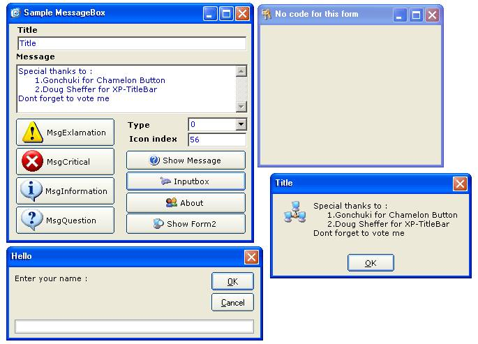



## \[\_\_\_Form XP \( Without XP \)\*\*\*\*\*\*\*\*UPDATE\*\*\*\*\*\*\*\*\*\*

### Description

***UPDATE : ___

You can make your application layout like Windows XP, although you run your application in others OS ( such as Win98 ).
 
### More Info
 

             |
---                |---
**Submitted On**   |2003-04-17 13:26:02
**By**             |[Osen Kusnadi](https://github.com/Planet-Source-Code/PSCIndex/blob/master/ByAuthor/osen-kusnadi.md)
**Level**          |Intermediate
**User Rating**    |4.7 (331 globes from 70 users)
**Compatibility**  |VB 6\.0
**Category**       |[Custom Controls/ Forms/  Menus](https://github.com/Planet-Source-Code/PSCIndex/blob/master/ByCategory/custom-controls-forms-menus__1-4.md)
**World**          |[Visual Basic](https://github.com/Planet-Source-Code/PSCIndex/blob/master/ByWorld/visual-basic.md)
**Archive File**   |[\[\_\_\_Form\_X1577624212003\.zip](https://github.com/Planet-Source-Code/osen-kusnadi-form-xp-without-xp-update__1-44773/archive/master.zip)

